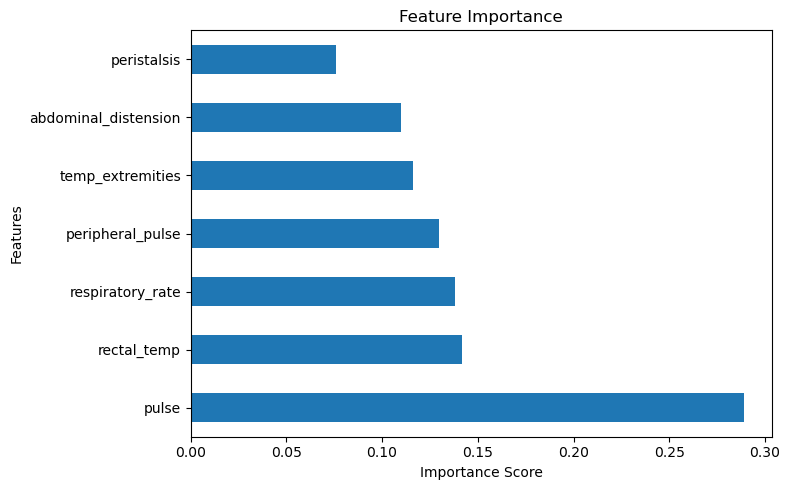
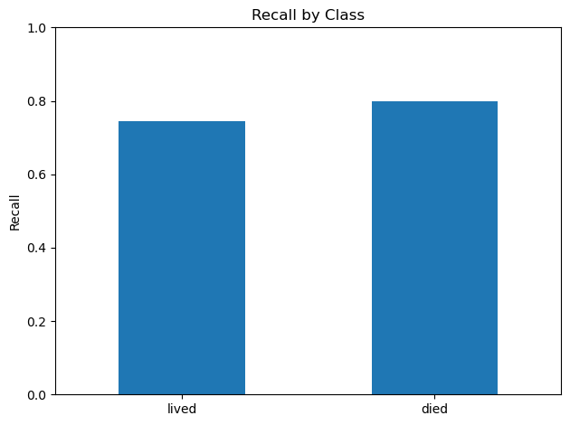

# Predicting Horse Colic with Wearable Data

## The Problem
What are the main indicators of colic severity in horses, and is it possible to track them with wearables?

Colic is a common but incredibly dangerous medical condition for horses. It presents suddenly, requires immediate treatment, and is the leading cause of death in horses. The Horse Colic dataset from UCI Machine Learning Repository contains data on many different biometrics, many of which could be tracked with wearables. If several key metrics are trackable with wearable devices, then it could lead to owners being notified of a potential problem and horses getting early treatment.

## Why This Matters

Animals often struggle to communicate their discomfort, so real time data analysis could make a huge difference in animal healthcare. 

Horses are both companions and high value athletes. The equestrian industry has a clear economic incentive to maintain the health of these high value horses and invest in improvements to healthcare technology. Most importantly, developing a method of predicting colic could save countless horses' lives.

## The Approach

To investigate this, I used the Horse Colic dataset from UCI Machine Learning Repository, which contains medical data from hundreds of horses diagnosed with colic. However, not all medical measurements are possible to be gathered with wearable devices. I narrowed the focus to biometrics that could reasonably be tracked in real time, such as:

- Heart rate (pulse)
- Body temperature
- Respiratory rate
- Indicators of circulation and gut activity

I then trained machine learning models to predict the severity of the cases. This was determined by the outcome, whether the horse survived or not. Since this is a binary classification problem, I started with a Decision Tree model. I prioritized a high recall, especially on the lethal cases. 

## The Findings

The final Random Forest model achieved significantly higher recall for the "died" class compared to the Decision Tree models. This is very important for this use case, as the goal is to minimize false negatives (cases where a severe condition is missed).

The improvement in recall can be attributed to a few things. The Random Forest model is simply better suited to this problem. As stated earlier, it handles the complexities of the dataset well. Also, class weighting made a huge difference in prioritising lethal cases.

The feature importance plot highlights which measurable variables contribute most to predicting severe outcomes. Pulse and abdominal distension rank highly, indicating a strong relationship with colic severity. This supports the hypothesis that wearable devices tracking cardiovascular activity and physical changes could be effective in early detection. However, none of the individual variables has a particularly strong correlation with severity, meaning that it is the combination of these metrics that allows the predictions to work.

Recall was prioritized for this project, since missing a severe case of colic could have lethal consequences. A higher recall for the "died" class was prioritized over the overall recall. As shown in the chart, the overall recall rate is roughly 80%. This means that the majority of severe cases can be predicted, but this is not high enough to be a reliable tool.

This suggests that wearable monitoring of these metrics could provide meaningful early warning signals for severe colic cases, as well as other conditions.

## Limitations and Ethics

This analysis has several limitations:

- The dataset contains a high percentage of missing values, which may reduce model accuracy.
- Many features included in the wearable subset are not currently measurable with standard wearable devices and would require advancements in technology.
- The dataset is relatively small, which limits the available training data for the model.
- Clinical data contains subjectivity (e.g., pain levels), which wearables are unable to track.
- Each horse is different, and this model does not account for the normal conditions of each horse.

From an ethical perspective, false positives may lead to unnecessary concern or intervention, while false negatives could result in delayed treatment and harm to the animal. This model performed well, but not well enough. Several lethal cases of colic went unnoticed, which could lead to the horse going untreated.

If too much trust is placed in wearable devices false negatives are highly dangerous. Reliance on automated systems should not replace professional veterinary judgment but rather serve as a supplementary tool.

### References

- [UCI Machine Learning Repository: Horse Colic Dataset](https://archive.ics.uci.edu/dataset/47/horse+colic)
- [Scikit-learn documentation](https://scikit-learn.org/stable/)

### AI Transparency

ChatGPT was used to assist with debugging and explanation of machine learning concepts. All final decisions, analysis, and interpretations were completed by me.